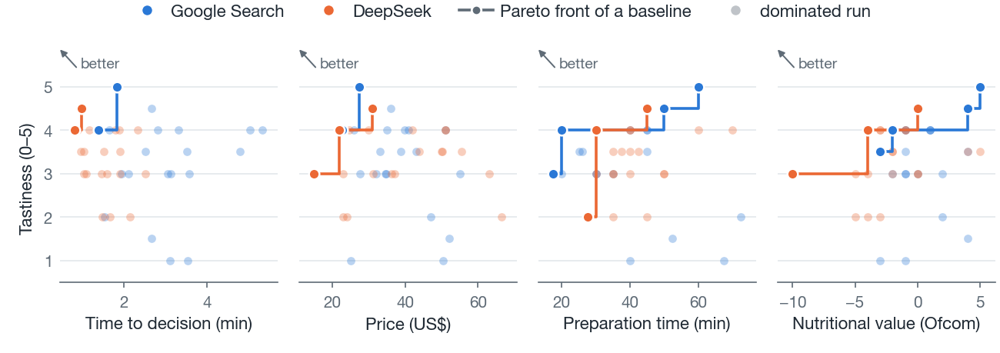

# Baseline evaluation results

Generated by `code/results/analyze_baselines.py` from `Baselines.xlsx`. 20 scenarios, each run with both baselines (40 runs). All metrics are measured offline, on the one recipe the user chose in a run.

## Scorecard

| Metric | Unit | Better | Google Search (mean) | DeepSeek (mean) | Difference | Google wins | Ties | DeepSeek wins |
|---|---|---|---|---|---|---|---|---|
| Grocery shopping time | min | lower | **49.8** | 50.0 | +0.2 | 11 | 3 | 6 |
| Meal preparation time | min | lower | **39.0** | 40.9 | +1.8 | 11 | 3 | 6 |
| Price | US$ | lower | **37.60** | 38.51 | +0.91 | 10 | 0 | 10 |
| Tastiness | 0-5 | higher | 3.23 | **3.33** | +0.10 | 7 | 6 | 7 |
| Nutritional value | Ofcom score | lower | 0.40 | **-2.10** | -2.50 | 1 | 2 | 17 |
| Diet violation | share of runs | lower | 5% | **0%** | -5 pp | 0 | 19 | 1 |
| Time to decision | min:sec | lower | 2:58 | **1:30** | -1:28 | 2 | 0 | 18 |

The better mean is in bold. Difference is DeepSeek minus Google. Wins count the scenarios (of 20) in which a baseline is strictly better; a tie counts for neither.

## Pareto comparison

For a scenario, one baseline dominates the other if it is at least as good on all seven metrics and strictly better on at least one.

**DeepSeek dominates in 3 scenarios, Google Search in 0, and in the other 17 each baseline wins on some metrics.**

| User | Scenario | Shop | Prep | Price | Taste | Nutr. | Diet | Decide | G wins | D wins | Dominates |
|---|---|---|---|---|---|---|---|---|---|---|---|
| jeremyti | Asian | = | G | G | = | D | = | D | 2 | 2 | neither |
| jeremyti | Italian | G | G | G | G | D | = | G | 5 | 1 | neither |
| jeremyti | Green onion and ginger | G | G | G | = | = | = | D | 3 | 1 | neither |
| jeremyti | Fish | G | G | D | D | D | = | D | 2 | 4 | neither |
| jeremyti | Tasty and filling | G | G | D | G | D | = | G | 4 | 2 | neither |
| sourajak | American, no beef | D | G | D | G | D | = | D | 2 | 4 | neither |
| sourajak | Body building | = | = | G | D | D | D | D | 1 | 4 | neither |
| sourajak | Bengali, healthy | D | G | G | G | D | = | D | 3 | 3 | neither |
| sourajak | North Indian, high protein | G | G | D | G | D | = | D | 3 | 3 | neither |
| sourajak | South Indian, high protein | D | G | D | G | D | = | D | 2 | 4 | neither |
| jgai | Northern Chinese | D | D | D | D | D | = | D | 0 | 6 | **DeepSeek** |
| jgai | Southeast Chinese | D | G | G | D | G | = | D | 3 | 3 | neither |
| jgai | Chinese, more vegetables | G | D | G | D | D | = | D | 2 | 4 | neither |
| jgai | U.S.-style Chinese, tasty | G | D | G | D | D | = | D | 2 | 4 | neither |
| jgai | Taiwanese | G | D | G | = | = | = | D | 2 | 2 | neither |
| istepka | Mexican, high protein | G | D | D | = | D | = | D | 1 | 4 | neither |
| istepka | Korean vegetarian, kimchi | G | G | D | = | D | = | D | 2 | 3 | neither |
| istepka | Tofu and soy sauce | G | D | G | G | D | = | D | 3 | 3 | neither |
| istepka | Broccoli-based vegetarian | = | = | D | = | D | = | D | 0 | 3 | **DeepSeek** |
| istepka | Gnocchi | D | = | D | D | D | = | D | 0 | 5 | **DeepSeek** |

G: Google Search is better. D: DeepSeek is better. =: tie. Columns: grocery shopping time, meal preparation time, price, tastiness, nutritional value, diet violation, time to decision.

## Trade-offs

One dot per run. Lower cost and higher tastiness are better, so the ideal corner is the top left of every panel. The line joins the non-dominated runs of each baseline in that panel. Drawn by `code/results/plot_tradeoffs.py`.

## Related files

- `scorecard.csv`, `pareto_by_scenario.csv`: the two tables above as data
- `../data/baseline_runs.csv`: every run with all recorded and cleaned values
- `../data/recipes/`: the recipe each run ended with
- `../code/nutrition/output/nutrition_report.md`: how the nutritional value of each recipe was computed
